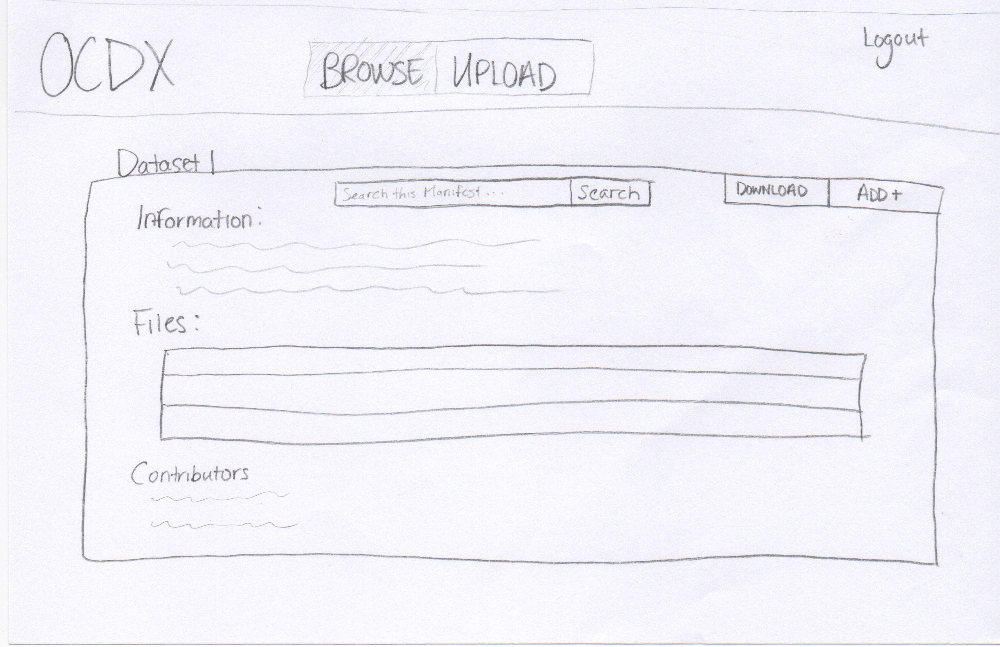
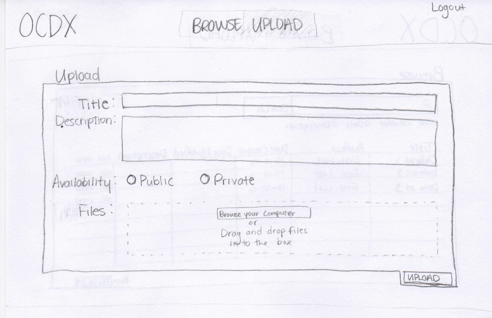
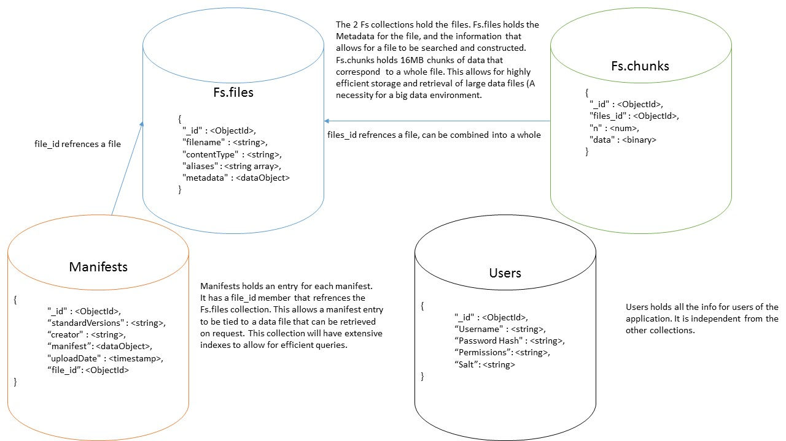

# CS 4320 Final Project: Requirements Analysis & Software Design

## OCDX Engine

### [GitHub Repository](https://github.com/holtwashere/CS4320-FinalProject)
### [Deployment Environment](http://ec2-35-161-12-137.us-west-2.compute.amazonaws.com/)

### Team 4 Members:
  - Holt Skinner *Project Manager*
  - Justin Hofer
  - Ali Raza
  - Bo Zhang
  - Bradley Rogers
  - Pramod Pudotha

---

# Table of Contents
- Requirements Analysis
  - User Descriptions
  - Use Cases
  - Functional Requirements
  - Non-functional Requirements
  - User Requirements
  - System Requirements
- Software Design
  - Sketches
  - Data
  - Change Log

---

# Requirements Analysis

## User Descriptions
*Rogers/Pudotha*

- **Data Scientist**
  - Uploads and downloads data
  - Conducts sophisticated and systematic analyses of data
  - Extracts insights from large data sets
- **System Administrator**
  - Review the uploaded data
  - Manage users

## Use Cases
*Skinner/Hofer*
- A Data Scientist can Browse by keyword for Manifest
- A Data Scientist can Search on Manifest
- A Data Scientist can Contribute to Existing Dataset
- A Data Scientist can Download Info
- A Data Scientist can Generate or Upload Manifest
- A Data Scientist can Save
- A Data Scientist can Upload Data Set

## Functional Requirements
_Pudotha/Skinner_
- The system will take an inputted manifest and place it into storage.
- The system will retrieve a manifest from storage and present it to a Data Scientist.
- The user interface can accept and serve search, upload, and update requests to and from Data Scientists.
- The system will process search, upload, and update requests, both into and out of Database Layer.

## Non-Functional Requirements
*Hofer/Raza*

### User Non-functional
- Data Scientists will be able to perform efficient searches based on keywords. Users should not wait more than about two seconds for a query to resolve.
- Data Scientists will be  able to upload and update manifests.
- Data Scientists will be able to upload and download data files.

## System Requirements
*Raza/Pudotha/Hofer*
- **Space Requirements**
	- The system must have enough physical space to handle extremely large data-sets.
	- The system may need to be a distributed system using clusters for efficiency.
- **Reliability Requirements**
	- If the system crashes, the data and any manipulations/analytics must be preserved.
- **Privacy Requirements**
	- The data access must be limited to authorized users only.
	- The system must enable secure data transfer over the internet
- **Web Server**
  - Web Server must provide reliable service for the appropriate amount of traffic that will be sent and received from the system.
- **Database Backend**
  - Database must be able to convert data into easily storable format, and return in original format.
- **Storage Array**
  - System must create intermediate backups and update logging to revert to earlier states if needed

## User Requirements
*Zhang/Rogers*
- Data scientists will be able to upload Manifest.
- Manifest can be reviewed by other data scientists.
- Data scientists can edit or delete their Manifest.
- Data scientists can search for Manifest they wish to view or test.
- Data scientists will be able to include special comments or suggestions on manifest
- Data scientists should be able to notify the changes or suggestions that improves manifest to other users
- System admins can ban an illegal data scientist
- System admins can delete an illegal manifest

---

# Software Design

## Sketches
*Skinner/Rogers*
- User can Browse by keyword for Manifest
- User can Contribute to Existing Dataset
- User can Download Info
- User can Search on Manifest

- User can Generate or Upload Manifest
- User can Save
- User can Upload Data Set

## Data
*Zhang/Hofer*

- **Members**
    - ID
    - name

- **OCDX_manifest**
    - author
    - date
    - size
    - category
    - version
    - modify_request

- **Users**
    - ID
    - name
    - email
    - phone

- **Login_attempts**
    - userID
    - date
    - attempts

---
<!-- ## Functions -->

# Sprint 1 ---

## updates:
 - The User Acceptance Tests are explained based on use cases.
 - Added unit tests failure cases, the functions to be tested are clarified.
 - Explained integration testing. 

# Database Structure

---

# Deployment Enviornment
*Raza*

- Hosting Platform: [Amazon Web Services](https://aws.amazon.com/)
- Operating System: [Ubuntu 16.04.1](http://releases.ubuntu.com/16.04/)
- Web Server: [Apache HTTP Server 2.4](http://httpd.apache.org/docs/current/)
- Database: [MongoDB](https://www.mongodb.com/)

---

# Testing
*Zhang/Hofer*

1.  Build user acceptance test scenarios for documented requirements on separate Wiki page, linked to all sprints.
2.  Build unit test scenarios
3.  Describe regression testing and your regression testing plan.
4.  Describe how your team will perform integration testing. What needs to be integrated? When?
5.  Describe which tests are for verification and which tests are for validation

# User Acceptance Test (UAT) Scenarios

## Data Scientist Uploads Manifest
 - If the user has not signed in, the action fails and the message "login first" shows on screen.
 - If the user signed in, but the file is not acceptable (file is too big or type is illegal), the action fails and the reminding message shows.
 - If the user signed in, and the file is valid, the action succeeds and the success message shows.

## Data Scientists Review Manifest
 - If the manifest is still valid, it is extracted from database and shows to the user.
 - If the manifest is no longer valid, the action fails and the message "manifest does not exist" shows.

## Data Scientists Search for Manifest
 - If the keyword matches any records in the database, they are shown to the user.
 - If the keyword cannot match any record in the database, the error message is shown to the user.

## Data Scientists Notify Changes to Other Users
 - If the user to be notified still exists, a notification is sent to the user, and it shows notification success.
 - If the user no longer exist, the message shows user not exist.

## System Admin Bans an Illegal Data Scientist
 - The data scientist account is transferred to the "banned" group. A notification is sent to the user as well as the reason for the ban.

## System Admin Deletes an Illegal Manifest
 - The manifest is deleted (moved to "trash" group), and a notification and reason are sent to its author.

## Stable and Quick
 - The stability of the system is acceptable.
 - The reaction time is short for the server.

# Unit Test Scenarios
## Login Function
 - If the user exists, the action continues.
 - If the user does not exist, further action is denied and the error message is shown.

## Verify File Function
 - If the file size and type is an acceptable format, the action is allowed.
 - If the file size is too big or the type is illegal, the action is denied.

## Search for Manifest Function
 - The system finds the record from database by matching the keywords.
 - The system returns an error message if no record is found.

## Upload Function
 - The file is stored in the database.

## Download Function
 - The required file is pulled from database and presented to the user.

## Edit/Delete Manifest Function
 - The manifest is changed and database is updated.

## Failure: Page not Found
 - The required page is not found and it switches to an error page.

## Failure: Server is Down 
 - The server is not operating properly and it switches to an error page.

# Regression Testing
 - Regression testing is a type of software testing that verifies that software previously developed and tested still performs correctly even after it was changed or interfaced with other software.
 - In this system, a set of unit tests are prepared to cover all the functions of the software. The tests are run after every update or bug fixing.

# Integration Testing
 - Integration testing is the phase in software testing in which individual software modules are combined and tested as a group. 
 - We will perform integration testing after unit tests.

## User Uploads Manifest
 - The user can sign in, and choose the file to be uploaded, after the system check the file, the file is uploaded and the success message shows.

## User Reviews Manifest
 - The manifest is searched on the server. If it is still valid, it is extracted from database and shows to the user.

## System Admin Bans an Illegal Data Scientist
 - The data scientist account is transferred to the "banned" group. A notification is sent to the user as well as the reason for the ban.

## System Admin Deletes an Illegal Manifest
 - The manifest is deleted (moved to "trash" group), and a notification and reason are sent to its author.

## Failure Case
 - The system returns an error page when the required page is not found, or the server is down.

# Summary:
 - The unit testing, integration testing and regression testing are for verification, the user acceptance test is for validation.

---

# Change Log

- Version 1.0: Pre-Implementation Design *10-16-2016*
- Version 1.1: Sprint 1 *10-31-2016*

<!-- ---

# Glossary -->
