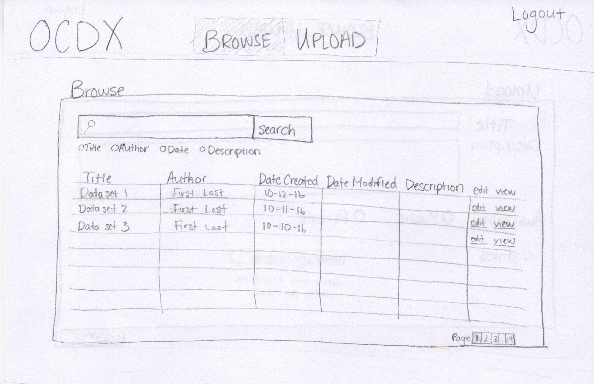

# CS 4320 Final Project: Requirements Analysis & Software Design

## OCDX Engine

### Team 4 Members:
  - Holt Skinner *Project Manager*
  - Justin Hofer
  - Ali Raza
  - Bo Zhang
  - Bradley Rogers
  - Pramod Pudotha

---

# Table of Contents
- Requirements Analysis
  - User Descriptions
  - Use Cases
  - Functional Requirements
  - Non-functional Requirements
  - User Requirements
  - System Requirements
- Software Design
  - Sketches
  - Data
  - Change Log

---

# Requirements Analysis

## User Descriptions
*Rogers/Pudotha*

- **Data Scientist**
  - Uploads and downloads data
  - Conducts sophisticated and systematic analyses of data
  - Extracts insights from large data sets
- **System Admin**
  - Review the uploaded data
  - Manage users

## Use Cases
*Skinner/Hofer*
- User can Browse by keyword for Manifest
- User can Contribute to Existing Dataset
- User can Download Info
- User can Generate or Upload Manifest
- User can Save
- User can Search on Manifest
- User can Upload Data Set

## Functional Requirements
*Hofer/Raza*
- **Database Backend**
  - The system will be able to perform efficient searches, using keywords.
  - The system should be able to upload and update manifests.
- **Business Logic**
  - Process search, upload, and update requests, both into and out of Database Layer
- **Front-End Framework**
  - Accept and serve search, upload, and update requests

## Non-Functional Requirements
*Raza/Pudotha*
- **Space Requirements**
	- The system must have enough physical space to handle extremely large data-sets.
	- We may need to implement a distributed system using clusters for efficiency.
- **Reliability Requirements**
	- If the system crashes, the data and any manipulations/analytics must be preserved.
- **Privacy Requirements**
	- The data access must be limited to authorized users only.
	- The system must enable secure data transfer over the internet

## User Requirements
*Zhang/Rogers*
- User will be able to upload Manifest.
- Manifest can be reviewed by others.
- User can edit or delete their Manifest.
- User can search for Manifest they wish to view or test.
- user will be able to include special comments or suggestions on manifest
- user should be able to notify the changes or suggestions that improves manifest to other users

## System Requirements
*Hofer/Rogers/Skinner*
- **Web Server**
  - Web Server must provide reliable service for the appropriate amount of traffic that will be sent and received from the system.
- **Database Backend**
  - Database must be able to convert data into easily storable format, and return in original format.
- **Storage Array**
  - System must create intermediate backups and update logging to revert to earlier states if needed

---

# Software Design

## Sketches
*Skinner/Rogers*
- User can Browse by keyword for Manifest
- User can Contribute to Existing Dataset
- User can Download Info
- User can Search on Manifest

- User can Generate or Upload Manifest
- User can Save
- User can Upload Data Set

## Data
*Zhang/Hofer*

- **Members**
    - ID
    - name

- **OCDX_manifest**
    - author
    - date
    - size
    - category
    - version
    - modify_request

- **Users**
    - ID
    - name
    - email
    - phone

- **Login_attempts**
    - userID
    - date
    - attempts

<!-- ## Functions

## Database Structure -->

---

# Change Log

- Version 1.0: Pre-Implementation Design *10-16-2016*

<!-- ---

# Glossary -->
